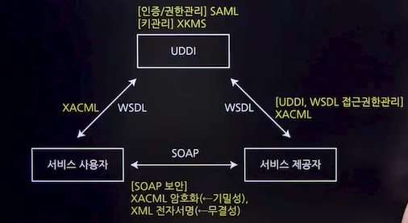

# 인터페이스 기능 구현
## 내.외부 모듈 연계 방식
### EAI(Enterprise Application Intergration)
- 기업 내의 다른 플랫폼 및 애플리케이션들을 연결, 통합하는 솔루션
- 목적: 비즈니스 통합 및 연계성 증대, 스시템 확장성 향상
- <U>EAI 구축유형</U>★
  - Point-to-Point
    - 미들웨어 없이 직접 애플리케이션끼리 연결
  - Hub&Spoke
    - 중앙 허브를 통한 중앙 집중적 연결 방식
    - 모든 데이터 전송 보장, 확장 및 유지보수 용이
    - 단점: 허브에 문제가 생길 경우 전체 시스템에 영향
  - Message Bus(ESB 방식)
    - 미들웨어를 사용하여 애플리케이션 사이에서 메시지를 전달
    - 뛰어난 확장성, 대용량 처리 가능
  - Hybrid
    - 내부적으로는 Hub&Spoke, 외부적으로는 메시징 버스 방식 사용
    - 표준 통합 기술 사용, 데이터 병목 현상 최소화

### ESB(Enterprise Service Bus)
- 웹 서비스 중심의 표준화된 데이터 버스를 이용하여 다양한 애플리케이션을 유연하게 통합하는 플랫폼
- ESB 구축 유형
  - 관리 및 보안 용이, 높은 품질 지원
  - EAI와 유사하지만 서비스 중심 통합을 지향
  - 단점: 표준화 필요, 벤더 종속성, 일부 성능 문제 존재

## 인터페이스 연계기숳
### DB Link
  - 데이터베이스에 제공하는 DB Link 객체를 이용
  - 수신 스스템에서 DB Link를 생성하고 송신 시스템에서 해당 DB Link를 직접 참조하는 방식
### DB Connection
  - 수신 시스템의 WAS에서 송신 시스템 DB로 연결하는 DB Connection Pool을 생성하고 연계 프로그램에서 해당 DB Connection Pool명을 이용
### JDBC
  - 수신 시스템의 프로그램에서 JDBC 드라이버를 이용하여 송신 시스템 DB와 연결
  - DBMS 유형, DBMS 서버 IP와 Port, DB Instance 정보가 필요함
### <u>API/Open API</u>
  - 송신 시스템의 애플리케이션 프로그래밍 인터페이스 프로그램
  - API명, 입출력 파라미터 정보가 필요함
### Web Service
  - *SOAP*(실제로 데이터를 주고받을 수 있는 프로토콜), *WSDL*(설명서,XML형태), *UDDI*(설명서를 모아두는 도서관)
### Hyper Link
### Socket
  - 상대 컴퓨터와 직접 연결하는 것
  - 통신 요청시 클라이언트와 연결하고 통신하는 네트워크 기술

## 인터페이스 전송 데이터
### JSON(JavaScript Object Notation)
- 자바스크립트의 객체 문법을 기반으로 데이터를 표현하는 문자 기반의 표준 포맷
- 웹 애플리케이션에서 주로 사용
- JSON 데이터는 이름과 값의 쌍으로 이루어져있음
### XML(eXtensivle Markup language)
- 웹에서 구조화한 문서를 표현하고 전송하도록 설계한 마크업 언어
- 문서 내용에 대한 구조와 의미를 기술하기 위한 언어
- 다양한 표현이 가능하고, 확장성이 뛰어나며 간단함
- HTML처럼 데이터를 보여주는 목적이 아닌 데이터를 저장하고 전달할 목적으로 만들어짐
- HTML처럼 태그가 정해져 있지 않고, 사용자가 직접 정의할 수 있음
### YAML(TAML Ain't Markup Language)
- 구성 파일 작성에 자주 사용되는 데이터 <u>직렬화 언어</u>
### CSV(Comma Separated Values) 
- 몇가지 필드를 쉼표(,)로 구분한 텍스트 데이터 및 텍스트 파일
- 표 형태의 데이터를 저장하는 파일 형식
- 엑셀에서 열림

## 인터페이스 구현
### <u>AJAX</u>(Asynchronous JavaScript and XML)
- 개념
  - 자바스크립트를 이용해 서버와 브라우저가 <u>비동기 방식으로 데이터를 교환할 수 있는</u> 통신 기능
  - 브라우저가 가지고 있는 XMLHttpRequest 객체를 이용
  - 전체 페이지를 새로고침하지 않고, *페이지의 일부*만을 변경할 수 있는 기법
- 비동기 방식 
  - 웹페이지를 리로드하지 않고 데이터를 불러오는 방식
  - 전체 리소스가 아닌 필요한 부분만 불러와 불필요한 리소스가 발생하지 않음
- 장/단점
  - 장점
    - 웹페이지 속도 향상
    - 서버의 처리가 완료될 때까지 기다리지 않고 처리가 가능
    - 필요한 데이터만 전송하면 되므로 전체적인 코딩의 양이 줄어듬
  - 단점
    - 히스토리 관리가 되지 않음
      - 뒤로가기 버튼 -> 바로 이전 페이지가 아닌 *처음 페이지로 이동*
    - 사용자에게 아무런 진행 정보가 주어지지 않음
    - 다른 도메인과 통신 불가능
### SOAP(Simple Object Access Protocol)
- 개념
  - 실제 데이터를 주고받는 프로토콜
  - HTTP, HTTPS, SMTP등을 통한 XML 기반 메시지 교환 프로토콜
- <u>구성</u>

  - HTTP, HTTPS, SMTP등을 통한 XML 기반 메시지 교환 프로토콜
  - UDDI(=도서관)
    - 비즈니스 업체 목록 등록을 위한 XML 규격
  - WSDL
    - 설명서
- 보안 프로토콜
  - SAML
    - 인증/권한 관리
  - XKMS
    - 키 관리
  - XACML
    - 접근 제어
- 장/단점
  - 장점
    - 프록시와 방화벽에 구애받지 않는 통신
    - 플랫폼 독립적
  - 단점
    - XML 포맷의 사용으로 인해 상대적으로 느림
### REST
- 개념
  - HTTP URI를 통한 자원 명시와 HTTP Method를 통한 CRUD Operation 적용
- 구성요소
  - 자원
    - URI를 통해 식별되는 서버의 데이터
  - 행위
    - GET, POST, PUT, DELETE
  - 표현
    - JSON, XML, TEXT
- CRUD Operation, HTTP Method
  - Create
    - *POST*(자원생성)
  - Read
    - *GET*(자원의 정보 조회)
  - Update
    - *PUT*(자원의 정보 업데이트)
  - Delete
    - *DELETE*(자원 삭제)
- REST 특징
  - 유니폼 인터페이스
    - HTTP 표준만 따르면 어떤 언어나 플랫폼에서 사용해도 사용이 가능한 인터페이스 스타일
  - Stateless(상태 정보 유지 안함)
  - Cacheable
    - HTTP가 가진 캐싱 기능이 적용 가능
  - Self-descriptiveness(자체 표현 구조)
    - REAT API 메시지만 보고도 쉽게 이해할 수 있는 자체 표현 구조로 되어있다.
- 장/단점
  - 장점
    - 별도 인프라 필요 없음
    - 클라이언트와 서버 분리
    - 플랫폼에 독립적
    - 사용 용이
  - 단점
    - 표준 부재(내가 만들면 그게 표준!)
    - HTTP Method 한계 (종류가 4개정도?)

## 인터페이스 보안
### 인터페이스 보안 취약점 분석
-인터페이스를 통한 데이터 변조, 탈취
- 패킷 공격 기법
  - 스니핑(Sniffing) = 지켜보는 것
    - 네트워크 상에서 전송되는 패킷을 가로채는 행위로, 주로 비밀정보를 탈취하는데 사용
  - 스푸핑(Spoofing)
    - 일반적으로 IP 주소나 다른 식별자를 위장하여 다른 사용자나 시스템으로 속이는 행위 

### 인터페이스 보안 기능 적용
- 네트워크 영역
  - 인터페이스 송/수신 간 스니핑 등을 이용한 데이터 탈취 및 변조 위협 방지 위해 네트워크 트래픽에 대한 암호화 설정
  - SSL, S-HTTP, IPSec
- 애플리케이션 영역
  - 시큐어 코딩 하자
- DB 영역
  - 민감 데이터 암호화, 익명화 등을 통해 데이터 자체 보안 고려 

# 인터페이스 구현 검증
## 인터페이스 검증
### 인터페이스 구현 검증 도구
- xUint
  - 다양한 언어를 지원하는 단위테스트 프레임 워크
- STAF
  - 서비스 호출 및 컴포넌트 재사용
- FitNesse
  - 웹 기반 테스트케이스 설계, 실행, 결과, 확인 등을 지원
- NTAF
  - 폐기됨
- Selenium
  - 웹 애플리케이션 테스트 프레임 워크
- watir
  - Ruby 사용하는 테스트 프레임 워크

### 인터페이스 구현 감시 도구
- APM(Application Performance Management)을 사용하여 동작상태 감시
- 데이터 베이스, 웹 애플리케이션의 다양한 정보를 조회하고 분석하여 시각화 함
- 스카우터(Scouter), 제니퍼(Jennifer) 등
