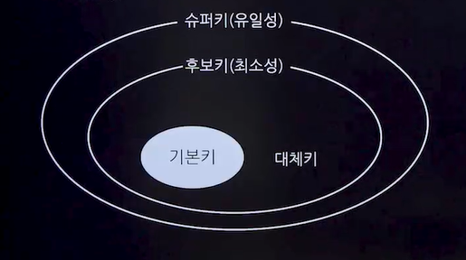

# 키와 무결성 제약조건
## 속성(컬럼)
- 릴레이션(테이블)에서 정보의 최소 단위로, 각 열을 통해 데이터의 상태나 특성을 나타냄
- 관계형 데이터베이스에서는 컬럼을 속성(Attribute)이라고도 함

### 특징
- 각 속성은 업무 프로세스에 필요한 정보로 구성되며, 하나의 속성에는 <u>하나의 값</u>만을 가질 수 있음 = 도메인이 원자값이어야 함(1정규형 만족)
- 여러 값이 필요한 경우 별도의 테이블로 분리

### 속성의 분류
- 기본속성
  - 업무로부터 추출한 모든 속성
- 설계속성
  - 코드성 데이터, 릴레이션 시별용 일련번호
- 파생속성
  - 다른 속성에 영향을 받아 발생하는 속성
  - 계산값, 합계 재고등
  
### 세부 의미에 따른 분류
- 단순 속성(Simple Attribute)
  - 나이, 성별같이 다른 속성들로 구성될 수 없는 단순한 속성
- 복합 속성(Composite Attribute)
  - 주소와 같이 시,구,동처럼 여러 세부 속성들로 구성될 수 있는 속성

### 구성방식에 따른 분류
- PK(Primary Key)
  - 릴레이션에서 튜플을 유일하게 구분할 수 있는 속성
- FK(Foreign Key)
  - 다른 릴레이션과의 관계에서 참조하고 있는 속성
- 일반속성
  - 릴레이션에 포함된 속성 중, PK와 FK가 아닌 속성

### 도메인
- 속성의 값 범위를 정하는 것
- 속성이 가질 수 있는 가능한 모든 값의 집합

## 키 종류
### 개념
- 키(Key)는 데이터베이스에서 튜플을 식별하고 구별하는 데 사용되는 컬럼이다.

### 종류
- 후보키(Candidate Key)
  - 릴레이션에서 튜플을 유일하게 식별할 수 있는 속성들의 집합
  - 반드시 하나 이상 존재해야 하며, <u>유일성과 최소성</u>을 만족해야 함
- 기본키(Primary Key)
  - 후보키 중에서 선택한 주키(Main Key)
  - <u>특정 튜플을 유일하게 식별할 수 있으며, NULL 값을 가질 수 없고, 중복된 값을 가질 수 없음</u>
- 대체키(Alternate Key)
  - 둘 이상의 후보키가 있을 때, 기본키로 선택되지 않은 나머지 키
- 슈퍼키(Super Key)
  - 튜플을 유일하게 식별할 수 있는 속성들의 집합이지만, <u>최소성</u>은 만족시키지 않음
- 외래키(Foreign Key)
  - 다른 릴레이션의 기본키를 참조하는 속성
  - 릴레이션 간 참조 관계를 표현하는 데 사용되며, <u>참조 무결성</u> 조건을 만족해야 함

## 데이터베이스 무결성
- 데이터의 정확성, 일관성 및 유효성을 보장하는 데이터베이스 관리 시스템(DBMS)의 중요한 기능
- 무결성 유지는 적절한 연산 제한을 통해 이루어짐

### 종류★★★
- 개체 무결성(Entity Integrity)
  - 모든 릴레이션은 중복되지 않는 고유한 값인 기본키를 가져야 함
  - 기본키는 NULL값을 가질 수 없음
- 참조 무결성(Referential Integrity)
  - 외래키는 NULL이거나 유효한 참조 릴레이션의 기본키와 일치해야 함
  - 제약조건
    - 제한(Restrict)
      - 문제의 연산을 거부
    - 연쇄(Cascade)
      - 참조된 튜플 삭제 시, 참조하는 튜플도 함께 삭제
    - 널값(Nullify)
    - 기본값(Default)
- 도메인 무결성(Domain Integrity)
  - 모든 속성 값은 정의된 도메인에 속해야 함
  - ex)'성별'컬럼에는 오직 '남'또는'여'만 허용
- 고유 무결성(Unique Integrity)
  - 릴레이션의 특정 속성 값은 서로 달라야 함
- 키 무결성(Key Integrity)
  - 각 릴레이션은 적어도 하나의 키를 가져야 함
- 릴레이션 무결성(Realation Integrity)
  - 삽입,삭제,갱신 등의 연산은 릴레이션의 무결성을 해치지 않도록 수행되어야 함
