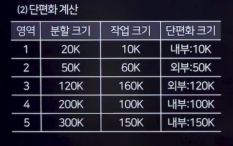

# 메모리 관리
## 기억장치 관리 전략
- 보조기억장치에 저장된 프로그램이나 데이터를 주기억장치에 언제, 어디에 적재할지를 결정하는 방법
- **반입(Fetch)전략**
  - 보조기억장치에 보관 중인 프로그램이나 데이터를 언제 주기억장치로 적재할 것인지를 결정하는 전략
  - 요구 반입(Demand)
    - 실행중인 프로그램이 특정 데이터를 필요로 할 때 해당 데이터를 주기억장치로 적재
  - 예상 반입(Anticipatory)
    - 실행 중인 프로그램이 미래에 참조할 것으로 예상되는 데이터를 미리 주기억장치로 적재
- **배치(Placement)전략**
  - 새로 반입되는 프로그램이나 데이터를 주기억장치의 어디에 위치시킬 것인지를 결정하는것
  - **최초** 적합(Firsrt Fit)
    - 사용 가능한 첫 번째 분할 영역에 프로그램이나 데이터를 배치
  - **최적** 적합(Best)
    - 단편화를 최소화하는 분할 영역에 배치
  - **최악** 적합(Worst)
    - 단편화를 최대화하는 분할 영역에 배치
- **교체(Replacement) 전략**
  - 이미 사용중인 주기억장치 영역 중에서 새로운 프로그램이나 데이터를 위해 어떤 영역을 교체할지 결정하는 전략
  - 종류: <u>FIFO,OPT,LRU,LFU,NUR,SCR</u> 등

## 주기억장치 할당 기법
### 단일 분할 할당 기법
- 한 사용자만이 사용하는 가장 단순한 기법으로, 경계 레지스터를 사용해 운영체제 영역과 사용자 영역을 구분함
- 프로그램의 크기가 작을 경우 사용자 영역이 낭비될 수 있음
- 주기억장치보다 큰 프로그램을 실행하기 위해 <u>오버레이 기법</u>과 <u>스와핑 기법</u>을 사용함
- 오버레이(Overlay)
  - 보조기억장치에 저장된 프로그램을 여러 개의 조각으로 분할
  - 필요한 조각만을 순서대로 주기억장치에 적재하여 프로그램을 실행
  - 주기억장치의 공간이 부족할 경우, 필요하지 않은 조각이 위치한 장소에 새로운 프로그램 조각을 중첩하여 적재
- 스와핑(Swapping)
  - 하나의 프로그램 전체를 주기억장치에 할당하여 사용하다가, 필요에 따라 다른 프로그램과 교체하는 기법
  - 이 방법은 가상기억장치의 페이징 기법으로 발전

### 다중 분할 할당 기법
- 주기억장치를 여러 영역으로 나누어 프로그램을 할당함
- 고정 분할 기법
- 가변 분할 기법

## 단편화
- 주기억장치에 프로그램 할당과 반납 과정에서 발생하는 빈 공간
### 종류
- 내부 단편화
  - 사용 공간을 할당 후 사용되지 않고 남아있는 공간
- 외부 단편화
  - 프로그램이 커서 할당되지 못한 남아있는 공간

