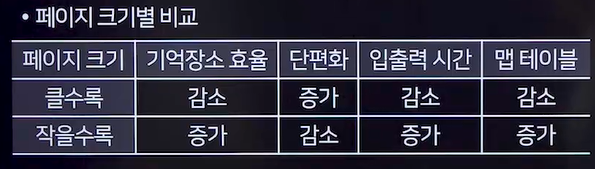
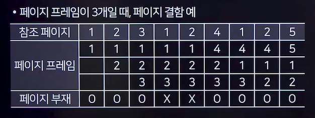
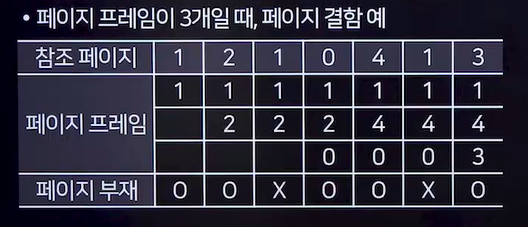
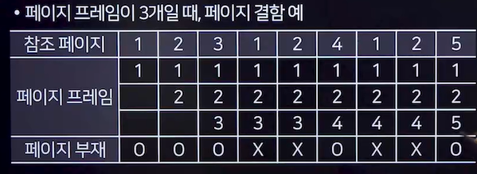
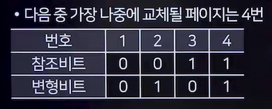

# 가상기억장치
## 가상 기억장치
- 보조 기억장치(하드디스크)의 일부를 주기억장치처럼 사용하는 기법
=> 개념 무조건 외우기!!!
- 주기억장치의 용량이 작더라도 가상기억장치를 통해 큰 용량처럼 사용 가능
- 주기억장치의 용량보다 큰 프로그램을 실행할 수 있으며, 주기억장치의 이용률과 '다중 프로그래밍' 효율을 높일 수 있음

### 블록 분할 방법
- 페이징(Paging)기법
  - 가상기억장치를 모두 같은 크기의 블록(페이지)으로 편성하여 운용하는 기법
  - <u>외부 단편화는 발생하지 않으나 내부 단편화는 발생</u>
  - 가상 메모리를 페이지로, 물리 메모리를 프레임으로 나누며, 주소 변환을 위해 <u>페이지 맵 테이블이 필요</u>
  - 페이지 크기별 비교

- 세그먼테이션(Segmentaion)기법
  - 가상 메모리를 '크기가 다른 논리적 단위'인 세그먼트로 분할하고 메모리를 할당하는 기법
  - 세그먼트 테이블을 참조하여 주소 변환을 수행
  - 기억공간을 절약하기 위해 사용되며, 세그먼트가 주기억장치에 적재될 때 다른 세그먼트에게 할당된 영역을 침범할 수 없음
  - 내부 단편화는 발생하지 않으나, <u>외부 단편화가 발생</u>

## 가상기억장치 기타 관리사항
### 페이지 부재
- 프로세스 실행 중 필요한 페이지가 주기억장치에 없는 상황
- 페이지 부재가 발생하는 횟수를 페이지 부재 빈도라고 함

### 지역성(Locality)
- 프로세스가 실행되는 동안 주기억장치에서 일부페이지만 집중적으로 참조하는 성질
- 스레싱 방지와 워킹 셋 이론의 기초
- 종류
  - 시간 구역성(Temporal Locality)
    - 하나의 페이지가 짧은 시간 동안 집중적으로 참조
  - 공간 구역성(Spatial Locality)
    - 프로세스 실행 시 특정 위치의 페이지들이 집중적으로 참조

### 워킹 셋(Working Set)
- 프로세스가 일정 시간 동안 자주 참조하는 페이지들의 집합(비슷한것들을 같이 가져오는 것!)
- 워킹 셋을 주기억장치에 상주시켜 페이지 부재와 페이지 교체 현상을 줄이고, 프로세스의 메모리 사용을 안정화 함
- 워킹셋은 시간에 따라 변화

### 스래싱(Thrashing)
- <u>프로세스 처리 시간보다 페이지 교체에 소요되는 시간이 더 많아지는 현상</u>
- 자주 페이지 부재가 발생하여 시스템 성능이 저하되는 상황

## 페이지 교체 알고리즘
### FIFO(First In First Out)
- 가장 먼저 메모리에 적재된 페이지를 먼저 교체하는 기법
- 프레임 개수를 늘리면 부재 발생이 감소해야하나, 오히려 더 늘어나는 Belady's Anomaly 이상 현상 발생

=> 대치상태: 5,1,2 / 부재횟수: 7번

### OPT(Optimal replacement, 최적교체)
- 미래에 가장 오랫동안 사용되지 않을 페이지를 교체하는 기법
- 이론적으로는 페이지 부재 횟수를 최소화하지만, 실제 구현에서는 미래의 페이지 참조를 예측하기 어려움

### LRU(Least Recently Used)
- 가장 오랫동안 사용되지 않은 페이지를 교체하는 기법

=> 대치상태: 1,4,3 / 부재횟수: 5번

### LFU(Least Frequently Used)
- 사용 빈도가 가장 적은 페이지를 교체하는 기법

=> 1,2,5/5번

### NUR(Not Used Recently)
- 각 페이지마다 참조 비트와 변형 비트를 사용하여 최근 사용 여부를 확인
- 참조되지 않고 수정되지 않은 페이지를 우선적으로 교체하는 기법

### SCR(Second Chance Replacement)
- FIFO의 단점을 보완한 기법으로, 가장 오래된 페이지 중에서도 자주 사용되는 페이지의 교체를 방지