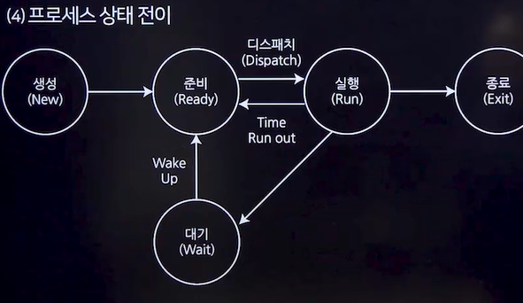

# 프로세스
## 프로세스
- 컴퓨터에서 연속적으로 실행되고 있는 컴퓨터 프로그램
- 실행 가능한 프로세스 제어 블록(Process Control Block,PCB)을 가진 프로그램
- 운영체제가 관리하는 실행 단위로, <u>프로세서가 할당되는 실체</u>
- 활동중인 프로시저

### 스레드(Thread)
- 프로세스 내에서 실행되는 흐름의 단위
- 하나의 프로세스는 최소 하나 이상의 스레드를 가지며, 스레드는 '경량 프로세스'라고도 불림
- 각 스레드는 독립된 스택 영역을 가지지만, 부모 프로세스의 코드,데이터,힙 영역은 공유
### 스레드의 분류
- 사용자 수준의 스레드
  - 사용자 수준 라이브러리 사용
- 커널 수준의 스레드
  - 운영체제 커널이 스레드를 관리

### 메모리상의 프로세스 영역
- 코드 영역
  - 실행할 프로그램의 코드가 저장되는 영역
  - 함수,제어문,상수 등이 지정
- 데이터 영역
  - 전역 변수와 정적 변수(Static)가 할당되는 부분
  - 프로그램 종료 시 메모리에서 소멸
- 스택 영역
  - 프로그램이 자동으로 사용하는 임시 메모리 영역
  - 지역 변수와 함수의 매개변수가 저장
  - 함수 호출이 완료되면 해당 정보는 사라짐
- 힙 영역
  - 프로그래머가 할당하고 해제하는 메모리 공간
  - 동적 할당

### 프로세스 상태전이★★★

- 제출(Submit)
  - 사용자가 작업을 시스템에 제출한 상태
- 접수(Hold)
  - 제출된 작업이 디스크의 Spool 공간에 저장된 상태
- 준비(Ready) 
  - 프로세스가 프로세서 할당을 기다리는 상태
- 실행(Running)
  - 프로세스가 프로세서를 할당받아 실행되는 상태
- 대기(Wait)
  - I/O 처리가 필요하여 실행을 중단하고 대기 중인 상태
- 종료(Exit)
  - 프로세스 실행이 끝나고 할당이 해제된 상태

### 프로세스 상태 전이 용어
- **Dispatch**
  - 준비 상태 -> 실행 상태
- **Wake up**
  - 대기 상태 -> 준비상태
- Spooling
  - 입/출력 데이터를 모아뒀다가 한꺼번에 입/출력하기 위해 디스크에 저장하는 과정

### PCB(Process Control Block, 프로세스 제어 블록)
- 운영체제가 프로세스의 정보를 저장하는 공간
- 각 프로세스가 생성될 때마다 고유한 PCB가 생성되며, 프로세스 종료 시 해당 PCB는 제거됨
### 문맥 교환(Context Switching)★★★
- 하나의 프로세스가 CPU 사용을 마치고 다른 프로세스가 CPU를 사용하도록 전환하는 과정
- 이 과정에서 현재 실행 중인 프로세스의 상태(문맥)는 프로세스 제어 블록(PCB)에 저장되고, 새로운 프로세스의 상태는 PCB에서 읽어 CPU레지스터에 적재됨
- 문맥 교환은 멀티태스킹(멀티 프로세싱)을 가능하게 하며, 여러 프로세스가 동시에 실행되는 것처럼 보이게 함

## 프로세스 스케줄링
- 메모리에 올라온 프로세스들 중 어느 프로세스를 먼저 처리할지 순서를 정하는 것
- Ready Queue에 있는 프로세스들 중 CPU를 할당받을 프로세스를 결정하는 과정

### 스케줄링의 목적
- 공평성
- 효율성
- 안정성
- 반응 시간 보장
- 무한 연기 방지

### 스케줄링 기법★★★
- 선점형 스케줄링(Preemptive) 
  - 운영체제가 실행 중인 프로세스로부터 CPU를 강제로 빼앗을 수 있는 방식
  - 오버헤드가 많이 발생할 수 있음
  - 종류★★★
    - **Round Robin**,**SRT**,다단계 큐(**MLQ**,Multi-Level Queue),다단계 피드백 큐(**MFQ**,Multi-Level Feedback Queue) 등
- 비선점형 스케줄링(Non-Preemptive)
  - 프로세스가 CPU를 점유하고 있다면 이를 빼앗을 수 없는 방식
  - 공정성을 보장하고 문맥 교환 '오버헤드'가 적지만, 처리율이 떨어질 수 있음
  - 다음에 처리해야 할 프로세스와 관계없이 응답시간을 예상할 수 있음
  - 종류: **FCFS**,**SJF**,**HRN**,**우선순위**,**기한**부 등
- 기아현상과 에이징 기법
  - 기아현상(Starvation)
    - 시스템에 부하가 많아서 우선순위가 낮은 프로세스가 무한정 기다리는 현상
    - SJF,우선순위,SRT,MLQ
  - 에이징 기법(Aging)
    - 기아현상을 해결하기 위한 기법
    - 오랫동안 기다린 프로세스에게 우선순위를 높여주는 기법
    - HRN,MLFQ

## 스케줄링 알고리즘
### 선점형 기법
- **Round Robin**
  - 시간 단위(Time Quantum 또는 Time Slice)를 정하여 프로세스에 순서대로 CPU 할당하는 방식
  - 컴퓨터 자원을 사용할 기회를 프로세스들에게 공정하게 부여하기 위한 방법
- **SRT**(Shortest Remaining Time)
  - 비선점형 스케줄링인 Shortest Job First(SJF) 기법을 선점 형태로 변형한 기법
  - 남아 있는 <u>실행 시간</u>이 가장 짧은 프로세스에 CPU를 먼저 할당
- 다단계 큐(**MLQ**, Multi-Level Queue)
  - 프로세스를 <u>특정 그룹으로 분류</u>하고, 각 그룹에 따라 다른 준비 상태 큐를 사용하는 기법
  - 특정 그룹의 준비 상태 큐에 들어간 프로세스는 다른 준비 상태 큐로 이동할 수 없음
  - 하위 준비 상태 큐의 프로세스가 실행 중일 때 상위 준비 상태 큐에 프로세스가 들어오면 상위 프로세스에게 CPU를 우선 할당함
- 다단계 피드백 큐(**MLFQ**, Multi-Level Feedback Queue)
  - 프로세스가 생성되면 가장 높은 우선순위의 준비 큐에 등록되며, FCFS 순서로 CPU를 할당받아 실행
  - 할당된 시간이 끝나면 다음 단계의 준비 큐로 이동
  - 단계가 내려갈수록 시간 할당량이 증가하며, 가장 하위 큐는 Round Robin 방식으로 운영
  - **적응기법(Adaptive Mechanism)**을 적용하여, 프로세스의 동작에 따라 그 위치를 조정

## 비 선점형 기법(종류 알아두기!!!)
- FCFS(First Come First Serve)
  - 먼저 도착한 프로세스를 먼저 처리하는 스케줄링 기법
  - 공평성이 유지되지만, 실행 시간이 긴 프로세스가 먼저 도착할 경우 효율성이 떨어질 수 있음
- SJF(Shortest Job First)
  - 실행 시간이 가장 짧은 프로세스에게 CPU를 할당하는 기법
  - 평균 대기시간을 최소화하는 최적의 스케줄링 방법이지만, **기아 현상이 발생할 수 있음**
- HRN(Highest Response ratio Next)
  - SJF에서의 불리함을 보완한 스케줄링 방식
  - 우선순위를 계산하여 프로세스에 순서를 부여하는 기법
  - 우선순위=(대기시간+실행시간)/실행시간
  - 실행 시간이 긴 프로세스는 대기시간이 길어질수록 우선순위가 높아짐
- 우선순위(Priority)
  - 각 프로세스에 우선순위를 부여하고, 높은 우선순위를 가진 프로세스에게 먼저 자원을 할당하는 기법
  - 우선순위가 낮은 프로세스는 **기아상태에 빠질 위험이 있음**
- 기한부(Deadline)
  - 프로세스에게 일정한 시간을 주어 그 시간 안에 작업을 완료하도록 하는 기법
  - 시간 내에 작업을 완료하지 못하면 프로세스는 제거되거나 처음부터 다시 실행되어야 함