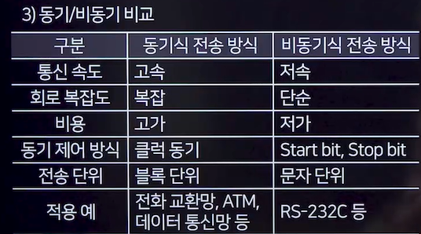

# 네트워크 기본
## 네트워크
- Net+Work의 합성어
- 컴퓨터와 같은 노드들이 통신 기술을 이용하여 그물망처럼 연결된 통신 이용 형태

### 거리 기반 네트워크
- PAN(Personal Area Network)
- **LAN**(Local Area Network)
  - 근거리 네트워크로 사무실과 같은 소규모 공간 내의 고속 통신 회선
- MAN(Metropolitan Area Network)
  - LAN과 WAN의 중간 형태
- **WAN**(Wide Area Network)
  - 광대역 네트워크 망으로 유관한 LAN간의 연결(LAN이 모여서 WAN이 됨!)

## 네트워크 토폴로지(Network Topology)
### 계층형(Tree)
- 계층적 구조로, 한 노드가 여러 하위 노드를 가짐
- 관리가 쉽고 확장성이 좋음
### 버스형(Bus)
- 모든 노드가 하나의 중앙 버스 라인에 연결됨
- 설치가 간단하고 비용이 적게 듬
### 성형(Star)
- 모든 노드가 중앙 노드(예:스위치,허브)에 연결된
- 중앙 노드에 의존적이어서 이 노드가 고장이 나면 전체 네트워크가 마비됨
- 개별 링크의 장애는 중앙 노드를 제외한 다른 노드에 영향을 미치지 않음
### 링형(Ring)
- 각 노드가 순환 형태로 두 개의 인접 노드와 연결됨
- 일반적으로 토큰 패싱(토큰을 가진 장치만이 데이터를 전송)방식을 사용하여 데이터 전송
- 한 노드나 연결에 문제가 생기면 전체 네트워크에 영향을 미침
### 망형(Mesh)
- 노드들이 서로 광범위하게 연결되어 있음
- 매우 높은 신뢰성과 내결함성을 제공
- 설치 및 유지보수 비용이 높음
- 회선수:n(n-1)/2

## 데이터 전송
### 아날로그/디지털 전송
- 아날로그 전송
  - 전송매체를 통해 '아날로그 신호 형태'로 전달됨
  - 신호 감쇠가 심하고 오류 발생 확률이 높음
- 디지털 전송
  - 전송 매체를 통해 '디지털 신호 형태'로 전달됨
  - 거리에 따른 감쇠는 없으나, 장거리 전송을 위해 '리피터' 사용 필요
  - 신호 왜곡이 적어 정확한 데이터 전송 가능

### 방향에 따른 구분
- 단방향 통신(Simplex)
  - 일방적인 통신만 가능(예:라디오,TV)
- 반이중 통신(Half Duplex)
  - 양방향 데이터 전송 가능하지만, 동시 전송은 불가능(예:무전기)
- 전이중 통신(Full Duplex)
  - 양방향 데이터를 동시에 송수신할 수 있는 통신(예:전화)

### 직렬전송/병렬전송
- 직렬 전송(Serial Transmission)
  - 한번에 한 비트씩 순서대로 전송
  - 데이터 전송 속도 느림
  - 구축이 쉽고 경제적임
- 병렬 전송(Parallel Transmission)
  - 문자 단위 등 여러 비트를 동시에 전송하는 방식
  - 데이터 전송 속도 빠름
  - 흐름제어 필요

### 동기 전송/비동기 전송
- 동기식 전송 방식(Synchronous Transmission) 예: 배추를 일렬로 옮기기
  - 동기문자나 플래그 사용하여 데이터 블록의 시작과 끝을 표시
  - 문자 동기 방식
    - SYN: 동기 맞춤 문자
    - STX(Start of Text): 실제 전송할 데이터의 시작
    - ETX(End of Text): 데이터의 종료
  - 비트 동기 방식
- 비동기식 전송 방식(Asynchronous Transmission)
  - 데이터의 시작과 끝을 Start Bit와 Stop Bit로 표시하여 동기화
  - 각 문자 사이에 휴지기간이 있어 스톱비트 지속 전송 

