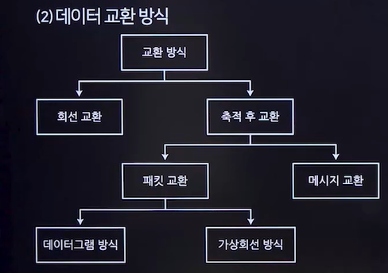

# 데이터 교환 방식과 다중화
## 데이터 교환 방식
### 회선망의 종류
- 전용회선
  - 항상 고정된 통신회선을 사용하는 방식
  - 일대일 연결로 송수신
  - 빠른 전송 속도, 낮은 전송 오류
  - 데이터 전송량과 사용 시간이 많을 때 효율적
  - 고장 발생 시 유지보수에 유리
  - 고비용 발생
- 교환회선
  - 교환기를 통해 송/수신측이 연결 되는 방식
  - 전용회선에 비해 전송 속도가 느림
  - 보안 측면에서 기밀성과 무결성 고려 필요
  - 장치와 회선 비용 절감 가능

### 데이터 교환 방식

- 회선 교환
  - 교환기를 이용해 두 지점을 물리적으로 접속
- 메시지 교환(축적 후 교환에 속함)
  - 두 노드 간의 통신경로가 미리 설정되지 않음
  - 비 실시간 전송에 적합
- 데이터그램 방식
  - 논리적 연결 없이 데이터 패킷 독립적으로 전송
  - 각 패킷은 순서와 무관하게 전송
  - 짧은 메시지 전송에 효과적이며, 패킷 재정렬 필요
- 가상회선 방식
  - 회선 교환과 데이터그램 방식의 장점을 결합
  - 패킷 전송 전 논리적 연결을 수행
  - 별도의 호(Call)설정 과정이 있음

## 다중화(Multiplexing)
### 개념
- 하나의 통신 회선을 여러 가입자가 동시에 사용할 수 있게 하는 기능
- 하나의 통신 회선에 여러 터미널이 공유 가능
- 전송 효율 향상을 위한 선로 공동 이용

### 다중화기(MUX, MultipleXer)
- 여러 개의 터미널 신호를 하나의 통신 회선을 통해 전송할 수 있게 하는 장치

### 다중화기 종류(종류 알아두기!!)
- 주파수 분할 다중화기(FDM, Frequency Division Multiplexer)
  - 물리적 통신 채널을 여러 주파수 채널로 나누어 사용
  -  주파수 분할의 완충 지역으로 Guard Band를 주어야 하므로 대역폭의 낭비가 발생
- 시분할 다중화기(TDM, Time Division Multiplexer)
  - 한 전송로의 데이터 전송 시간을 <u>일정한 시간 폭으로 나누어</u> 여러 채널에 차례로 분배하는 방식
  - 동기식 시분할 다중화(효율 낮음)
  - 비동기식 시분할 다중화
- 코드 분할 다중화(CDM, Code Division Multiplexer)
  - 고유의 코드를 사용하여 여러 데이터 신호를 결합하는 다중화 방식
  - 공통 주파수 대역을 통해 여러 사용자가 동시에 전송
- 파장 분할 다중화(WDM, Wavelength Division Multiplexing)
  - 광 다중화 방식
  - 광 섬유에 적용
- 공간 분할 다중화(SDM, Space-Division Multiplexing)

### 역다중화기와 집중화기
- 역다중화기(Inverse MUX)
  - **하나의 고속 통신 회선**으로부터 데이터를 받아, 이를 **여러 개의 저속 회선**으로 나누어 전송하는 장치
- 집중화기(Concentrator)
  - 여러개의 저속 회선에서 전송된 데이터를 버퍼에 축적한 후, 이를 모아서 하나의 고속 회선으로 전송하는 장치

