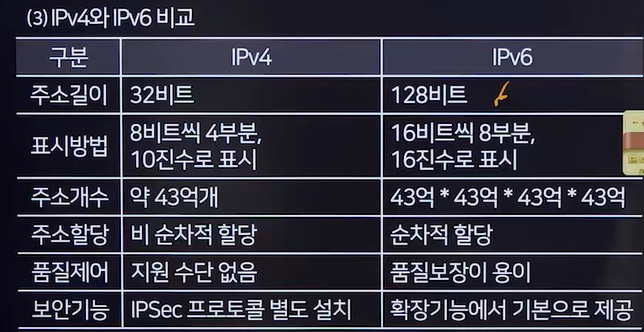
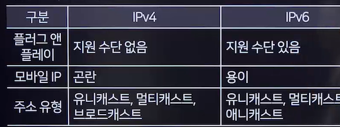
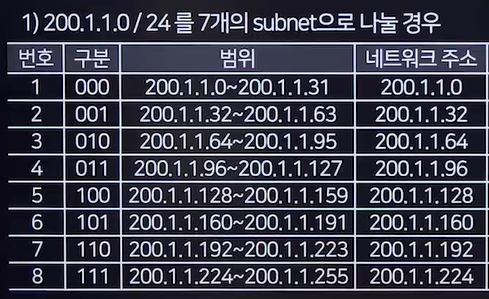

# 인터넷
## 인터넷
- TCP/IP 프로토콜을 기반으로 전 세계의 다양한 컴퓨터와 네트워크들이 연결된 광범위한 통신망
### 인터넷 서비스
- WWW(World Wide Web)
  - 인터넷상의 텍스트, 이미지, 비디오, 오디오 등을 연결하는 종합 정보 서비스
  - HTTP 프로토콜과 하이퍼텍스트 기반
- 전자우편(E-MAIL)
- 텔넷(Telnet)
  - 원격 위치의 컴퓨터에 접속하여 사용하는 서비스
- HTTP(Hyper Text Transfer Protocol)
- FTP(File Transfer Protocol)
- 아키(Archie)
- 고퍼(Gopher)
- 유즈넷(USENET)

## IP
### IP(Internet Protocol Address)주소
- 인터넷에서 컴퓨터나 다른 네트워크 장치를 식별할 수 있는 고유한 번호 
- IPv4/IPv6
  - 현재 널리 사용되는 주소 형식은 IPv4
  - IPv4는 '총 32비트'로 구성되며, 8비트씩 4부분으로 나뉨(예:192.168.1.1)
- 서브넷 마스크
  - 네트워크 부분과 호스트 부분을 구분하기 위해 사용됨
### 주소 분류(IPv4)
- 유니캐스트(Unicast)
  - 단일 송신자와 단일 수신자
- 멀티캐스트(Multicast)
  - 단일 송신자와 다중 수신자
- 브로드캐스트(Broadcast)
  - 같은 네트워크의 모든 장비에게 보내는 통신

### IP 주소 클래스
- A Class(0으로시작)
  - 옥텟 IP: 0~127
- B Class(10으로 시작)
  - 옥텟 IP: 128~191
- C Class(110으로 시작)
  - 옥텟 IP: 192~223

### IPv6
- IPv4 주소 고갈 문제를 해결하기 위해 개발된 차세대 인터넷 프로토콜 주소
- '128비트' 크기로 확장된 주소 체계를 가짐

### IPv6 헤더
- 기본 헤더
  - 확장 헤더를 포함하지 않은 경우의 기본 헤더(40바이트)
- 확장 헤더
  - 기본 고정 헤더 뒤 페이로드 내에 선택적인 확장 헤더들이 뒤따라옴

### 주소 분류
- 유니캐스트
- 멀티캐스트
- **애니캐스트**(Anycast)
  - 그룹 내 가장 가까운 수신자에게 전달

### IPv4/IPv6 전환기술 ★★★
- **듀얼스택(Dual Stack)**
  - 장비들이 IPv4및 IPv6을 모두 지원하며, 두 프로토콜을 동시에 처리 가능
- **터널링(Tunneling)**
  - IPv6 패킷을 IPv4 패킷 속에 캡슐화하여 전송하는 기술
- **주소변환(Address Translation)**
  - IPv6 시스템과 IPv4 시스템 간의 헤더 변환을 통해 상호 운용성을 제공

*** 주소 유형 중요!!!!

## 서브넷
### 서브넷, 서브넷 마스크
- 서브넷
  - 하나의 큰 네트워크를 더 작은 네트워크로 분할한 것
  - 네트워크 관리를 용이하게 하고, 보안 및 트래픽 관리에 도움을 줌
- 서브네팅(Subnetting)
  - 네트워크의 성능을 보장하고 자원을 효율적으로 분배하기 위해, 하나의 IP 네트워크를 더 작은 네트워크 영역으로 '나누는 과정'
  - 네트워크 영역과 호스트 영역을 나누어 관리하는 작업을 포함
- 서브넷 마스크(Subnet Mask)
  - IP 주소에서 네트워크 부분과 호스트 부분을 구분하는데 사용됨
  - 서브넷 마스크와 IP 주소의 AND연산을 통해 네트워크 주소를 결정

### 서브네팅 예

- 200.1.1.65/27의 서브넷 마스크
  - 호스트 주소 중 3비트를 네트워크 아이디로 사용하여, 255.255.255.224이 서브넷 마스크가 됨

## IP기타기술
### NAT의 개념(Network Address Translation)
- 사설 IP 주소와 공인 IP 주소 간의 변환을 통해 내부 네트워크와 외부 인터넷 간의 통신을 가능하게 하는 기술
- IPv4 주소 고갈 문제 해결을 위해 개발

### 사용 목적
- 공인 IP 주소의 절약
- 내부 네트워크의 보안 강화

### 주소 할당 방식에 따른 NAT 종류(종류만 알아두기!!)
- Static NAT
- Dynamic NAT
- PAT(Port Address Translation)

### DNS(Domain Name System)
- 도메인 이름을 IP 주소로 변환하거나 그 반대의 작업을 수행하는 시스템
- DNS 서버는 도메인 이름과 해당 IP 주소의 데이터베이스를 유지하고, 이를 요청하는 컴퓨터에 제공

### QoS(Quality of Service)
- 이용자의 만족도에 영향을 미치는 서비스 성능 관리

### **VPN**(Virtual Private Network)
- 공용 네트워크를 통해 사설 네트워크에 안전하게 접속할 수 있게 하는 기술
- 데이터 암호화와 안전한 터널링을 통해 보안과 개인정보 보호를 제공

### DHCP(Dynamic Host Configuration Protocol)
- 네트워크 장치에 '자동'으로 <u>IP 주소를 할당하는 프로토콜</u>
- 네트워크 관리를 간소화하고 IP 주소 사용을 효율적으로 만듬

