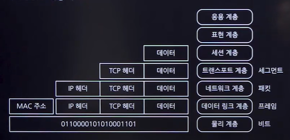

# OSI 7계층
## OSI(Open System Interconnection) 7계층
- 네트워크 프로토콜 디자인과 통신을 7개의 계층으로 나누어 설명하는 모델
- 국제표준화기구(ISO)에 의해 정립
- 통신 과정을 단계별로 파악 가능

## 계층별 특징**(응표세전네데물)**★★★

### 물리계층(Physical Layer)
- 기능
  - 데이터를 전기적 신호로 변환하여 통신 케이블을 통해 전송함
- 통신단위
  - 비트(1과0)
- 주요역할
  - 단순 데이터 전달, 내용이나 에러에 대해 처리하지 않음
- 장비
  - 통신 케이블, 랜카드, 리피터, 허브

### 데이터 링크 계층(DataLink Layer)
- 기능
  - 포인 투 포인트의 신뢰성 있는 데이터 전송을 보장하며, 물리 계층의 오류를 감지하고 수정함
- 주소지정
  - MAC주소
- 장비
  - 스위치,브리지

### 네트워크 계층(Network Layer)
- 기능
  - 데이터를 목적지까지 라우팅함
- 주요 역할
  - 경로 설정, 주소부여(IP주소)
- 장비
  - 라우터(L3스위치)

### 전송 계층(Transport Layer)
- 기능
  - <u>양 종단 간 신뢰성 있는 데이터 전송</u>을 책임짐
- 프로토콜
  - TCP(Transmisiion Control Protocol),UDP(User Datagram Protocol)
- 오류제어
  - 시퀀스 넘버 사용, 오류 검출 및 복구, 흐름제어

### 세션 계층(Session Layer)
- 기능
  - 양 끝단의 응용 프로세스 간 통신을 관리함
### 표현 계층(Presentation Layer)
- 기능
  - 다른 데이터 표현 형식 간의 변환을 담당함
### 응용 계층(Applicaiton Layer)
- 기능
  - 사용자 인터페이스, 응용 프로그램 간 통신을 관리함

## 네트워크 장비
- Lan 카드
  - PC와 네트워크 간 정보를 교환하는 데 사용되는 장치
  - LAN 카드에는 MAC 주소가 할당되어 있으며, 이는 48비트 물리적 주소
- 허브(Hub)
  - 네트워크 내의 여러 노드(예:컴퓨터)를 연결하는 집중화 장비
  - 네트워크에 연결된 모든 PC들을 하나의 중앙 지점으로 모아주는 역할
- 리피터(Repeter)
  - 디지털 신호를 증폭하여, 신호가 약해지지 않고 먼 거리까지 전송될 수 있도록 하는 장비 
- **물리 계층에 사용**

- 브리지(Bridge)
  - 두 개 이상의 LAN을 연결하여 하나의 확장된 네트워크를 형성하는 장치
- 스위칭 허브(Switching Hub)
  - 허브 기능에 스위치 기능이 추가된 장비
  - 네트워크 트래픽 관리 및 효율적인 데이터 전송을 위해 사용됨
- **데이터 링크 계층에 사용**

- 라우터(Router)
  - 패킷을 목적지까지 최적의 경로를 통해 전달하는 장치
  - 네트워크 간 라우팅 및 트래픽 관리를 담당
- 게이트웨이(Gateway)

## 백본(BackBone)
### 백본 네트워크
- 백본 네트워크는 '기간망'으로도 알려진 대규모 패킷 통신망
- 빠르게 전송할 수 있는 대규모 전송회선
### 백본 스위치
- 네트워크 중심에 위치하며 모든 패킷이 지나가는 역할
### 스위치의 종류
- L2
  - 데이터 링크 계층에서 운용되며, MAC주소를 기반으로 스위칭
- L3
  - 인터넷 계층(네트워크 계층)에서 운용되며, IP 주소를 기반으로 스위칭
  - 라우팅 기능이 탑재되어 있어, 라우터의 역할도 수행
- L4
  - 전송 계층에서 운용되며, 품질 서비스(QoS) 설정 등 다양한 기능을 제공
  - 서버나 네트워크의 트래픽을 로드밸런싱하는 데 사용
- L7
  - 응용 계층까지 운용되는 스위치로, 응용 계층의 패킷을 분석
  - 주로 보안 장비에서 사용