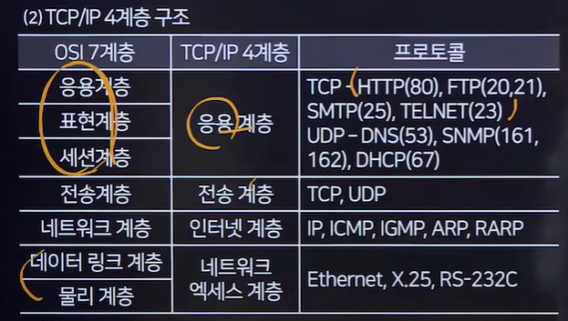

# TCP/IP
## TCP/IP(Transmission Control Protocol Internet/Internet Protocol)
- 현재 인터넷에서 널리 사용되는 프로토콜 모델
- 시스템 간 네트워크 연결과 데이터 전송에 사용됨
- TCP/IP는 인터넷 통신을 위한 표준 프로토콜 모델로 사용됨

### TCP/IP 4계층

## 계층별 특징
### 네트워크 액세스 계층(Network Access Layer)
- 프로토콜
  - Ethernet
  - X.25
  - RS-232C
### 인터넷 계층
- 프로토콜
  - IP
    - 비연결성 인터넷 프로토콜
  - ICMP
    - IP패킷 전송 중 에러 메시지 제공
  - IGMP
  - **ARP**
    - IP 주소를 MAC 주소로 변환
  - RARP   

### 전송 계층(Transport Layer)
- 프로토콜
  - TCP
    - 클라이언트와 서버 간 연결 설정 후 데이터 주고 받는 <u>연결 지향적</u> 프로토콜
    - 신뢰성 있는 데이터 전송을 보장
  - UDP
    - 연결 설정 없이 데이터를 주고받는 <u>비연결성 프로토콜</u>
    - TCP보다 빠른 전송 가능, 하지만 신뢰성은 떨어짐

### 응용 계층(Application Layer)
- 사용자와 직접적으로 상호작용하는 계층
- 프로토콜
  - TCP
    - HTTP
      - 웹 서버와 클라이언트 간의 하이퍼텍스트 문서 송수신 프로토콜
    - FTP
      - 파일 전송에 사용되는 프로토콜
    - SMTP
      - 이메일 전송에 사용되는 프로토콜
  - UDP
    - DNS
      - 도메인 이름을 IP 주소로 변환하는 프로토콜
    - SNMP
      - 네트워크 장비 관리에 사용되는 프로토콜
    - DHCP
      - IP 주소 자동 할당 및 관리 프로토콜

## TCP/IP 헤더
### IP(Internet Protocol)
- 호스트 간의 통신을 담당하는 프로토콜
- 패킷 교환 네트워크에서 정보를 주고받는 데 사용됨
- 비신뢰성(Unrelaiability)과 비연결성(Unconnectionlessness)을 가짐
- 흐름 제어나 오류 복구 기능이 없음
### TCP(Transmission Control Protocol)
- 연결형 서비스를 제공하는 <u>전송 계층 프로토콜</u>
- 신뢰성 있는 데이터 전달과 흐름제어를 수행
- IP와 함께 사용되어 데이터의 배달 처리 및 패킷 추적과 관리를 담당