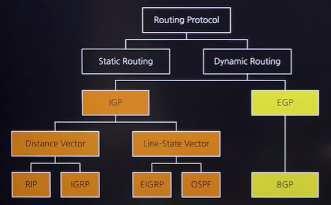

# 라우팅 프로토콜
## 라우팅 프로토콜
### 라우터(Router)
- 네트워크에서 데이터 패킷의 경로 설정(Path Determination)과 스위칭(Switching)을 담당하는 장비
### 라우팅 프로토콜
- 패킷이 목적지까지 도달하는 경로를 결정하는 프로토콜
- 네트워크의 다양한 경로 중 최적 또는 가장 효율적인 경로를 선택하는 데 사용
- RIP,OSPF,BGP 등이 있음

## 라우팅 프로토콜의 종류

- 동적 라우팅만 보기(Dynamic Routing)
- IGRP,EIGRP X

### 라우팅 경로 고정 여부
- 정적 라우팅 프로토콜(Static Routing Protocol)
- 동적 라우팅 프로토콜(Dynamic Routing Protocol)
  - 라우터가 네트워크 상태에 따라 라우팅 경로를 자동으로 결정
  - 종류: RIP,OSPF
### 내/외부 라우팅
- IGP(Interior Gateway Protocol)
  - 하나의 자치 시스템(AS, Antonomous System)내에서 사용되는 라우팅 프로토콜
  - 종류: RIP,OSPF
- EGP(Exterior Gateway Protocol)
  - 서로 다른 자치 시스템(AS)간 라우팅에 사용되는 프로토콜
  - 종류: BGP,EGP <u>이지피는 비지피다~~~</u>
### 라우팅 테이블 관리
- 거래 벡터 알고리즘(Distance Vector Algorithm)
  - 각 라우터가 인접한 라우터까지의 거리(홉 수)와 방향 정보만을 라우팅 테이블에 기록
  - RIP(Routing Information Protocol)
- 링크 상태 알고리즘(Link State Algorithm)
  - 각 라우터가 전체 네트워크의 링크 상태 정보를 가지고 SPF(Shortest Path First) 알고리즘을 사용하여 최적의 경로를 결정
  - 종류: OSPF(Open Shortest Path First)

## 주요 라우팅 프로토콜
### RIP(Routing Information Protocol)
- 벨만-포드 알고리즘을 사용하는 홉 수 기반 라우팅 프로토콜
- 최대 15홉 지원, 주로 소규모 네트워크에 적합
- 30초마다 라우팅 정보를 이웃 라우터와 교환
### OSPF(Open Shortest Path First)
- 다익스트라 알고리즘을 기반으로 하는 링크 상태 라우팅 프로토콜
- 홉 수,대역폭, 지연 시간 등을 고려하여 최적의 경로 선택
- 링크 상태 변화 시 라우팅 정보 전송
### BGP(Border Gateway Protocol) 는 EGP다!!!!!!!
- 다양한 경로 속성을 고려하여 최적의 경로 설정