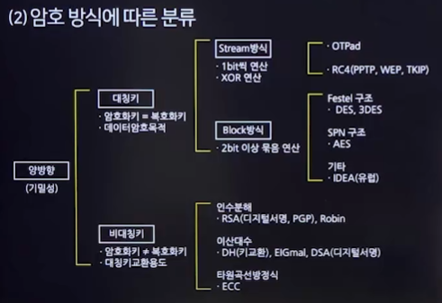
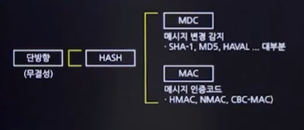

# SW개발 보안 구현
## 암호 알고리즘
### 암호 알고리즘 용어
- 평문(Plaintext)
  - 해독 가능한 형태의 메시지(암호화 전 메시지)
- 암호문(Ciphertext)
  - 해독 불가능한 형태의 메시지(암호화된 메시지)
- 암호화(Encryption)
  - 평문을 암호문으로 변환
- 복호화(Decryption)
  - 암호문을 평문으로 변환
- 전자서명
  - 인터넷상에서 본인임을 증명하기 위해 서명을 하는 수단
- 양방향 암호화
  - 평문->암호문, 암호문->평문으로 변경할 수 있는 암호화
- 단방향 암호화
  - 해싱을 이용하여 암호화하고, 평문으로 복호화는 불가능한 암호화

### 암호 방식에 따른 분류

### 대칭키 암호(Symmetric Key)
- 암호화와 복호화에 동일한 키를 사용하는 암호화 방식
- 혼돈과 확산의 원리를 활용하여 평문을 암호화
- 장/단점
  - 장점
    - 빠른 암호화 속도와 대용량 데이터 암호화에 적합
  - 단점
    - 키 교환 문제
    - 증가하는 사용자 수에 따른 키 관리의 어려움
    - 키의 개수:n(n-1)/2
- 블록암호 알고리즘
  - DES
    - **64**비트 블록과 **56**비트 키를 사용
    - 평문을 32비트로 나누고 **16**라운드에 걸쳐 치환과 전치를 수행
    - **Feistel** 네트워크 구조
  - 3-DES
    - 두개의 키를 사용하여 순서대로 암호화,복호화,다시 암호화를 수행
  - AES
    - **128**비트 블록 **128/192/256**비트 키로 암호화
    - 키 크기에 따라 10/12/14 라운드를 수행
    - **SPN**(Substitution-Permutation Network)구조
  - SEED
    - 한국에서 개발, 128비트 및 256비트 대칭키 블록 암호 알고리즘
  - ARIA
    - 한국 개발, 128/192/256 비트 키 지원
  - IDEA
    - 스위스 개발
    - **128**비트 키와 **64**비트 블록 크기, **8**라운드 구조
  - LEA
    - 한국에서 개발, 빅데이터, 클라우드,IOT,모바일 등 다양한 환경에서 사용
  - SKIPJACK
    - 미국의 NSA에서 개발
    - 전화기와 같은 음성을 암호화하는 데 주로 사용

- 스트림암호 알고리즘
  - LFSR
  - RC4
  - A5 

### 비대칭키 암호
- 비대칭키 암호 개념
  - 암호화와 복호화에 서로 다른 키를 사용하는 방식
  - 공개키 암호 방식이라고도 함
- 키의 종류
  - 공개키(Public Key)
    - 대중에게 공개된 키
  - 개인키(Private Key)
    - 개인이 관리하는 비밀 키
- 장/단점
  - 장점
    - 키의 분배와 관리가 상대적으로 용이
    - 사용자 수 증가에 따른 키 관리의 복잡성이 대칭키에 비해 상대적으로 낮음
    - 기밀성,인증,무결성 지원 및 부인 방지 기능을 제공
  - 단점
    - 키 길이가 길고 연산 속도가 느림
    - 암호화 가능한 평문의 길이에 제한이 있음
- 비대칭키 알고리즘
- 소인수 분해 기반
  - RSA
  - Rabin
- 이산대수 기반
  - Diffie-Hellman
  - DSA
  - ELGamal
  - ECC
- 타원 곡선 기반
  - ECC(이산대수, 타원곡선 둘 다 해당)

### 단방향 암호화
- 해시를 이용한 암호화 과정
- 평문을 암호화할 수 있지만 복호화는 불가능한 방식
  

- 해시 함수 특성
  - 역상 저항성
    - 주어진 해시 값으로부터 원래의 입력값을 찾아내는 것이 실질적으로 불가능해야 함
  - 제2역상 저항성(약한 충돌 저항성)
    - 특정 입력값에 대해, 동일한 해시 값을 생성하는 다른 입력값을 찾는 것이 어려워야 함
  - 충돌 저항성
    - 두 개의 다른 입력값이 동일한 해시 값을 가지지 않도록 해야 함
- 해시 함수 종류(**종류만 알아두기!!!**)
  - MD5
    - 1996년에 암호학적 결함이 발견되어 지금은 사용하지 않음
  - SHA
    - 미국 국가안보국(NSA)에 의해 설계되었으며 미국의 국가 표준
  - HAS-160
    - 국내 표준 전자서명 알고리즘
- 암호학적 해시 함수의 결점
  - 무차별 대입 공격(Brute-force Attack)
    - 정해진 범위 내의 모든 가능한 문자열을 이용해 암호를 해독하는 공격 방식
  - Rainbow Table 공격
    - 미리 계산된 해시 값들의 테이블을 이용하여 해시된 비밀번호를 역추적하는 공격 방식