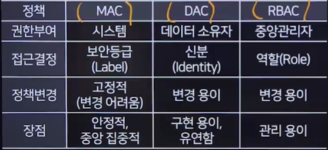

# 인증과 접근통제
## 인증과 인가
### 인증(Authentication)
- 로그인을 요청한 사용자의 정보를 확인하고 접근 권한을 검증하는 보안 절차

- 인증 유형
  - 지식 기반 
  - 소유 기반
  - 행위 기반
  - 생체 기반
  - 위치 기반

### 인가(Authorization)
- 인증된 사용자에게 권한을 부여하는 과정
- 권한에 따라 사용 가능한 기능이 제한

- 인증방식
  - 계정 정보를 요청 헤더에 넣는 방식
    - 가장 보안이 낮은 방식
    - HTTP 요청에 인증할 수단을 넣어서 전송하는 방식
  - **Cookie/Session** 방식★★★ (쿠키는 내 컴퓨터에 저장/세션은 서버에 저장)
    - 세션 기반인증을 위해 Session과 Cookie가 사용됨
  - 토큰 기반 인증 방식(JWT, JSON Web Token)
    - 암호화된 문자열을 이용하는 인증 방식
  - OAuth
    - 온라인 서비스에서 사용자의 자격 증명을 공유하지 않고도 한 서비스(예:웹 사이트 또는 애플리케이션)가 사용자를 대신해 다른 서비스에 접근할 수 있도록 하는 개방형 표준 인증 프로토콜
    - ex) 한 웹사이트에 올린 글이 내 트위터에도 인스타에도 올라가는 것!
  - **SSO(Single Sign-On)**★★★
    - 하나의 로그인 인증 정보를 사용해 여러 애플리케이션을 접근할 수 있는 인증 서비스
    - ex) CJ 계열 하나만 로그인 해도 나머지 로그인 되어있음!
  - 커버로스(Kerberos)
    - 개방된 네트워크에서 안전하게 서비스 요청을 <u>인증하기 위한 프로토콜</u>
  - 아이핀(i-PIN)
    - 주민등록번호 대체 인증수단, 개인정보 유출 최소화를 위해 도입

## 접근 통제
### 접근 통제 개념
- 정당한 사용자에게 권한을 부여하고 그 외의 사용자는 접근을 거부하는 것
### 접근 통제 과정
- 식별(Identification)
  - 사용자의 ID 확인 
- 인증(Authentication)
  - 사용자의 패스워드가 정확한지 확인
- 인가(Authorization)
  - 사용자에게 읽기,쓰기,실행하기 등의 권한을 부여
### 접근 통제 원칙
- 최소 권한의 원칙
- 직무 분리
  - 독단적으로 수행하지 않도록 직무 분리
### 접근 통제 정책★★★
- 강제적 접근 통제(MAC, Mandatory Access Control)
  - 자원의 보안 레벨과 사용자의 보안 취급 인자를 비교하여 접근을 제어
  - **기밀성**이 강조되는 조직에서 사용
  - 대표적인 모델
    - BLP(벨라파듈라)모델, Biba 모델 등
- 임의적 접근통제(DAC, Discretionary Access Control)
  - 자원 소유자가 다른 사용자의 접근을 허용하거나 제한할 수 있는 모델
- 역할기반 접근통제(RBAC, Role Based Access Control)
  - 정보에 대한 사용자의 접근을 개별적인 신분이 아니라 조직 내 개인 역할에 따라 허용 여부를 결정함
- 정책별 내용
  

- 괄호 쳐서 많이 나오니까 외워두기!! ★★★

### 접근 통제 모델
- 벨-라파듈라 모델(BLP, Bell-LaPadula Confidentiality Model)
  - '기밀성'을 중점으로 두는 모델, 주로 군사 및 국방 분야에서 사용
  - 정보가 높은 보안 레벨에서 낮은 레벨로 유출되는 것을 방지
  - <u>No Read Up, No Write Down</u>
- 비바 모델(Biba Integrity Model)
  - '무결성'을 강조하는 상업용 모델
  - <u>No Read Down, No Write Uo</u>
- 클락-윌슨 모델(Clark-Wilson Integrity Model)
  - '무결성'에 중점을 둔 상업용 모델
  - 상업적 응용 프로그램의 보안 요구사항에 초점
- 만리장성 모델(Chinese Wall Model,Breswer-Nash Model)
  - '이해 충돌을 방지'하기 위한 모델
  - 어떠한 정보의 흐름도 차단하여 '이해 충돌이 발생하지 않도록 함'